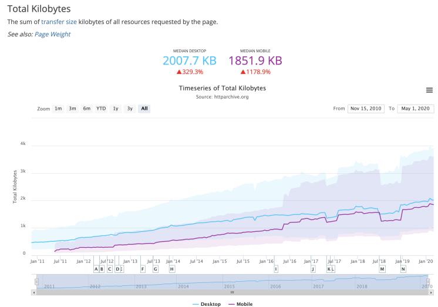

# 写在前面

## 性能-用户体验的重要因素

性能对于研发来说是一个经久不衰的话题，也是用户体验的重要因素。试想当你打开一个页面或者 APP 时，无论你是在寻找另你满意的商品，阅读高质量的新闻还是看有趣的短视频，都不会愿意等待。

用户可能有耐心排一两个小时的时间去排一个人气火锅店的排队，但却几乎没有人原因等哪怕 30s 去等待一个商品的加载。事实上对于大多 APP 或者网站来说，别说 30s，即使是 3s 也足以让大量的用户放弃等待转而去做别的事情。

> Google 发现，如果页面加载时间超过 3 秒，53% 的移动网站访问活动将遭到抛弃。

## 网速变快了，网站却没有

有人可能会问，如今电脑和手机的性能都在飞快发展，性能优化是否还是那么重要？5G 时代即将来临，极速的网络是否已经足以帮我们解决性能问题？

其实，在 WEB 世界，广为人知的安迪-比尔定律仍然成立。

> 安迪比尔定律源于这句话：“Andy gives, Bill takes away.(安迪提供什么，比尔拿走什么)”
> 
> Andy 指的是 Intel 原 CEO 安迪·格鲁夫；Bill 则是微软的比尔·盖茨。这句话的意思是，英特尔公司总裁安迪·格罗夫一旦向市场推广了一种新型芯片产品，微软 CEO 比尔盖茨就会及时的升级自己的软件产品，吸收新型芯片的高性能。硬件提高的性能，很快被软件消耗掉了。

对于 WEB 世界来说，网络和终端设备的性能确实是在飞速发展。然而对应的，几十年来 WEB 技术也变得越来越复杂。在网络上传输的不再是一个简单的页面。WEB 技术本身在以更高的速度飞速发展，页面传输的体积、执行脚本的复杂度等都在不断增长。

根据 HTTP Archive 的数据，从 2010 年到 2020 年，桌面端和移动端的页面传输字节数（加载完成一个页面需要传输的数据量）逐年上涨，分别增加了 329% 和 1178%。

同时，随着网络基础建设不断更新换代，网络上媒体的传播形式也越来越丰富。例如近几年短视频兴起，很大程度上就是因为大多数用户的网络能够在可以接受的时间内加载出视频。

可以想象，随着未来网络状况的进一步改善，又会有新的媒体形式去填满增长出的网络传输能力。

只要安迪比尔定律没有失效，性能优化就仍然是经久不衰的话题。

## 性能优化的魅力
虽然前面从现实的角度出发解释了性能优化的重要性，但其实性能优化本身就具备无可比拟的魅力。

我们很多人都听过斯坦门茨画一条线一万美元的故事，有些人说这个故事反映了知识就是财富，有些人说这个故事反映细节决定成败。故事的真实性已经不可考，但是我个人非常喜欢这个故事。

> 斯坦门茨的故事：相传美国福特公司曾经有一台电机出了毛病，导致整个车间都不能运转。公司调来很多专家查看，就是找不到问题出在哪。于是请来著名的物理学家、电机专家斯坦门茨帮助，斯坦门茨在电机旁聚精会神地听了3天，然后又要了梯子，爬上爬下忙了多时。最后在电机的一个部位用粉笔划了一道线，写下了“这里的线圈多绕了16圈。”人们照搬了，就立刻排查了故障。
在月薪普遍 5 美元的当时，斯坦门茨要了一万元的账单，开了个账单：画一条线，1美元；知道在哪儿画线，9999美元

如果说工程师最大的快乐来自于创造，那我认为第二大的快乐就是来自于对精密系统的理解。从中可以领略前人解决问题设计方案的智慧，也能享受抽丝剥茧最后精准找到问题的成就感。

性能优化就是典型这样一个场景。我们要做的是理解复杂系统并从中找到性能问题的关键。有时我们甚至能根据问题的表现和对系统的理解，在没有直接观测到具体问题时就推测出真正的原因，就像海王星先通过数学推算、再被人们实际观测到的过程，充满了预言的魔力。

<blockquote>
海王星的发现史：

• 1821 年人们出版了天王星（不是海王星）的轨道表，但是观测标明轨道存在偏差，于是有人猜测是因为受到附近一个巨大天体的扰动

• 五年后，天文学家通过数学方法完成了对这颗未发现天体位置的推算

• 在随后的观测中，成功在推算的位置发现了这个天体，就是海王星
</blockquote>

## 这本书会写什么

这本书会从不同的角度、结合具体的例子介绍针对于 WEB 场景（WEB 场景指 PC 站点、手机站点、APP 内部的 Hybrid 页面、React-native/WEEX 等 W3C 生态）性能的度量、分析和优化方法。

前三章会用真实的例子介绍我们面对性能问题的解决方案，性能的很多要素随着浏览器、网络协议的发展会改变，一些知识会失效。但度量、试验和分析的方法能够指导我们找到当下解决性能问题的方案。

后面的内容则是介绍针对不同场景的优化和当下有效的最佳实践，例如如何优化浏览器的渲染阻塞、如何优化图片、如何例如 CDN 进行优化等，也会用我们前面介绍的方法从中发现和验证优化方法。

