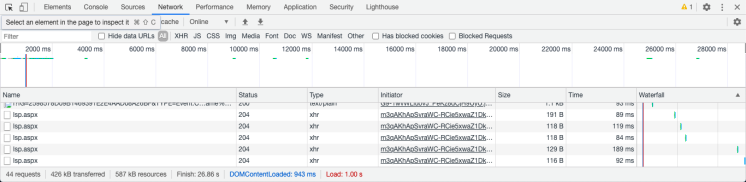
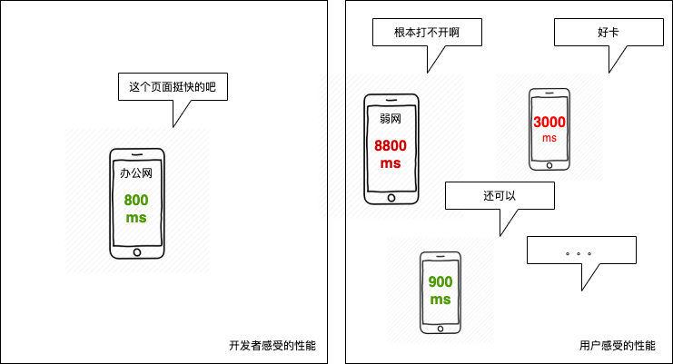

# 为什么度量很重要

## 难以复现的性能问题

> A：有客户反馈这个页面打开特别慢，会白屏很久
> 
> B：在我电脑上挺快的啊

相比于可以稳定在多数环境下复现的功能问题，性能问题往往和环境、机器等相关，难以进行稳定的复现。于是这天就有了以上的对话。

这种特性导致了两个问题：

• 我们对于性能往往停留于一个主观的感受，无法判断一个页面性能究竟是好是坏

• 我们往往只能看到单个环境下的性能状况，对于不同环境下的性能表现无从判断

在这种情况下，我们很容易只是简单地对页面做一些优化，就草草了结这个问题，但实际上用户体验和品牌的仍然无法改善。
## 不度量性能，就无法优化性能

> You can't manage what you can't measure.
> 
> 一件事如果你无法衡量它、你就无法管理它。   --管理大师彼得德鲁克

要对一个页面进行真正有效的优化，而不只是让自己感觉似乎快了一些，首先我们要能合理的度量它。度量也存在非常多的手段，在前面《什么是 WEB 性能》中，我们也曾经提到过，我们可以从用户感知和技术指标来衡量具体的性能。



例如说当我们刷新一个页面时，我们可以在 Chrome 的 Devtools Network 面板看到 onload、DOMContentLoaded 时间等，这是一种度量方式。

我们也可以用一个录屏软件对一个网页的打开时间进行计时，计算从打开到用户看到主要内容的时间。借助一些工具，我们可以在单点对一个页面的性能进行度量，从而减少我们主观感受在其中的占比，给页面性能一个相对客观的评估。

# 用户视角度量

单点度量的方式优势在于便捷，信息充足。然而只能让我们看到一个特定的实验室环境下的性能表现，无法反映我们的用户感受到的性能状况究竟如何。

而我们的优化本质上是为了带来更好的用户体验，如果我们的用户普遍机器性能较差，而我们的优化完的页面只是在我们自己高端机器上健步如飞，那优化就没有意义。



所以，为了评估真是用户感受到的性能，我们还需要建立起以用户为中心的度量方式，通过把不同用户的性能在前端采集，上报和统计分析用户的整体性能。

接下来会分别介绍我们如何从前端采集、计算用户的性能。

# 用户视角性能上报

## Performance API

想要能够在前端采集到页面的性能信息，浏览器提供了一些 API 辅助我们进行性能的测算和采集。这些 API 被称为 `Performance API` ，通常在 `window.performance` 这个对象下。

### performance.now()

为了测算一个任务的耗时，我们常常用多次调用 Date.now() 的方式计算差值：

```js
const startTime = Date.now();
// 做具体的任务 doTask()
// 最终耗时
const taskCostTime = Date.now() - startTime;
```

而这种方式存在两个问题：

• 在部分场景（例如游戏、`benchmark` 等）下的精度不够，只能精确到毫秒（`ms`）

• `Date.now()` 取的是时间戳（1970年到现在经过的秒数），依赖于客户端操作系统时间。如果用户记录了 `startTime` 然后修改了本地时间，就会出现任务耗时异常的情况（虽然这种情况理论上并不常见）
为了提供更高精度、更可靠的性能计时， `Performance API` 提供了 `performance.now()` 方法，具有以下特性：

• 精度精确到微秒（`us`）

• 获取的是相对当前页面打开的时间点，不依赖操作系统时间

需要注意的是，虽然 `performance.now()` 旨在提高更高精度的时间，但是由于 `Spectre` 漏洞的影响，现阶段主流浏览器都加入了一些精度上的扰动从而避免攻击。除此之外，Firefox 的一些隐私相关的设置可能也会影响相关的精度。

> `Spectre` 是一种依赖时间的针对具有预测执行能力 `CPU` （例如 `Intel`）的安全漏洞，允许恶意获取其他程序的内存内容。

#### 兼容性

部分浏览器还没有支持 `performance.now()` ，在这种情况下我们可以使用 当前时间戳 - 页面打开的时间戳 进行模拟：

```js
performance.now = function() {
  // performance.timing.navagationStart 表示页面打开时的时间戳，非高精度时间
	return Date.now() - performance.timing.navagationStart;
}
```

### 构建首屏指标

有了 `performance.now()` 后，我们就可以选取一个我们认为对于用户来说可以算作首屏的指标，并把相应的值采集上来。


例如我们在获取某个 API 的值后渲染了一个组件，我们认为这个时候可以被看做用户看到了想要看到的首屏，就可以记录这个点。

```js
const res = await fetch(API);
const data = await res.json();
domContainer.innerHTML = data;
// 记录
record(performance.now());
```

于是，我们就可以从用户视角上报一个性能指标用于统计分析。